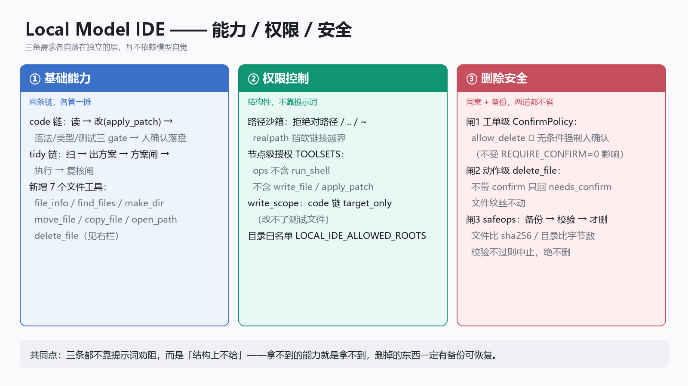

# 能力 · 权限 · 安全 —— 三条需求的落地说明（2026-10-03）

> 需求原文：
> 1. **基础能力**：既能修改代码，也能像 OpenClaw 那样进行一些基础的电脑操作。
> 2. **权限控制**：不能给予完整权限，仅限于进行整理文件等工作。
> 3. **安全机制**：每次执行删除命令时，必须经过用户同意，并且自动备份。




三条分别落在**工具层 / 规则层 / 安全层**，互不依赖提示词——

---

## 一、基础能力：两条链各管一摊

| 链 | 工单 `kind` | 能做什么 | 工具集 |
|---|---|---|---|
| 代码链 | `code` | 读 → 改（apply_patch）→ 语法/类型/测试三 gate → 人确认落盘 | recon / edit / verify / create / commit |
| 整理链 | `tidy` | 扫 → 模型出方案 → 方案闸 → 执行 → 复核闸 | ops（见下） |

整理链**新增的文件操作工具**（`core/statemachine/tools.py`，2026-10-03）：

| 工具 | 作用 | 危险级别 |
|---|---|---|
| `file_info` | 看文件/目录的大小、时间、类型、sha256 | 只读 |
| `find_files` | 按文件名/内容找（复用 tidy 的确定性实现） | 只读 |
| `list_dir` / `read_file` / `search_code` | 已有 | 只读 |
| `make_dir` | 建目录（含多级） | 低 |
| `move_file` | 移动 / 重命名（默认拒绝覆盖） | 中 |
| `copy_file` | 复制（默认拒绝覆盖） | 中 |
| `open_path` | 返回「在本机文件管理器里定位」所需信息 | 只读（不执行外部进程） |
| `delete_file` | **删除** | **高**（见第三节） |

关于「像 OpenClaw 那样操作电脑」：本版给的是**文件级操作**，不包含鼠标键盘控制、
不包含通用命令执行。`open_path` 只返回 `reveal_hint`（如 `explorer /select,"..."`）
与 `file://` URI，由前端决定是否打开——服务端不自己起任何外部进程。

---

## 二、权限控制：结构性，不靠提示词

三条防线，任意一条都能独立挡住越权：

1. **路径沙箱**（`ToolContext.resolve`）：拒绝绝对路径、拒绝 `~`、拒绝 `..` 逃逸；
   已存在的路径还要 `realpath` 一次，挡「软链接指向沙箱外」；兄弟前缀混淆
   （`/work-other` vs `/work`）也判越界。
2. **节点级工具授权**（`TOOLSETS`，R1）：
   - `ops` 工具集 = 文件整理类，**明确不含** `run_shell`、**不含** `write_file`/`apply_patch`
     ——拿不到任意命令执行权，也不做代码内容写入；
   - `edit` 节点只给 `apply_patch`（不给 `write_file`）——它无法整文件重写；
   - `shell` 单列，且参数必须过危险模式闸。
3. **写范围**（`write_scope`）：
   - code 链 = `target_only`：模型**改不了测试文件**（否则就能把测试「改绿」）；
   - 整理链 = `root`：可动整个整理根，但仍在沙箱内。
4. **目录白名单**（`LOCAL_IDE_ALLOWED_ROOTS`）：服务端策略，设了就只允许在这些根下作业。

---

## 三、安全机制：删除 = 同意 + 备份

「每次删除都要人同意」「自动备份」这两条**都在结构上成立**，不依赖模型自觉。

### 3.1 同意（两道闸）

| 闸 | 位置 | 怎么保证 |
|---|---|---|
| 工单级 | `service/app.py::ConfirmPolicy` | 工单一旦声明 `allow_delete=true`，`effective_confirm()` **无条件返回 True** ——不受 `LOCAL_IDE_REQUIRE_CONFIRM=0` 影响 |
| 动作级 | `tools.delete_file` | 不带 `confirm=true` 的调用**只返回 `needs_confirm` 与预计备份位置，不动文件**；必须重放才真删 |

整理链的流程也天然要求确认：`dry_run` 只出方案 → `awaiting_confirm` → `POST /wo/{id}/confirm` 才执行。

### 3.2 备份（`core/statemachine/safeops.py`）

唯一真相源，tools 与 tidy 共用。顺序是**先备份、再校验、最后才删**：

```
备份到 <根目录>/.ide-backup/<时间戳>/<原相对路径>
  · 单文件：copy2 后比 sha256，不一致 → 中止且不删
  · 目录  ：copytree 后比（文件数 + 总字节），不一致 → 删掉半成品备份、中止
校验通过 → 才执行删除
```

配套：
- 备份目录**自身不可被操作**（`backup_and_delete` 直接拒绝 `.ide-backup` 开头的路径）；
- 同秒多次删除不会撞名（自动加 4 位随机后缀）；
- 复核闸（`verify_after`）逐条核对「声称删掉的，备份文件确实存在」——删了但没备份
  会报最高优先级告警 `delete_without_backup`；
- 恢复方式：把备份文件复制回原路径即可（或整棵 `.ide-backup/<时间戳>/` 拷回根目录）。

### 3.3 默认仍是零删除

`TidyOrder.constraints["allow_delete"]` 默认 `False`。没声明就开启删除的方案，
方案闸直接报 `delete_not_allowed`，引擎按安全边界**判死不回炉**（`security_abort`）。
`overwrite` / `rmtree` 这类会绕过备份的写法**永远禁止**。

---

## 四、验证

```bash
python scripts/selftest.py --core      # 含「核心·整理工具与删除安全」21 例
python core/statemachine/test_ops_tools.py   # 单独跑
```

覆盖点：越界拒绝、`target_only` 拦截、备份目录保护、**不带 confirm 不删**、
**带 confirm 删且备份逐字节一致**、从备份恢复、目录删除需 recursive、
同秒多次删除不撞名、复核闸的备份核对。
